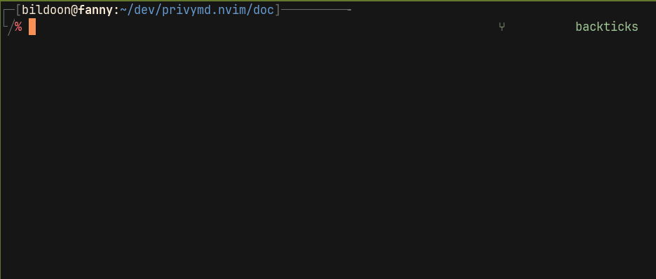

# PrivyMD

A Neovim plugin for editing Markdown files that contain **secure, GPG-encrypted text blocks** — without disrupting your normal editing workflow.

PrivyMD lets you protect sensitive information (passwords, credentials, private notes) directly inside Markdown files while keeping them fully readable and versionable.
All encryption and decryption happen transparently in memory, ensuring that no plaintext is ever written to disk.

---

## Features

- Transparently encrypt and decrypt clearly defined text blocks with minimal changes to your editing flow
- Automatic decryption when opening a file
- Automatic encryption when saving a file
- Passphrase requested only once per session
- Properly respects Neovim’s *modified* buffer flag
- Never writes plaintext to disk without explicit user confirmation

---

## Why PrivyMD?

PrivyMD was designed for users who want to keep sensitive information — passwords, credentials, or personal notes — inside their Markdown files *without sacrificing readability or convenience*.

Unlike most encryption tools, PrivyMD integrates seamlessly with Neovim:
- Works transparently on fenced `gpg` code blocks
- Uses no temporary files or external buffers
- Keeps your Markdown workflow exactly the same — only sensitive parts are protected

It’s a lightweight, memory-safe way to bring **privacy-aware writing** to your Markdown workflow.

---



---

## Requirements

- **Neovim ≥ 0.10**
- **GnuPG** — the `gpg` executable must be available in your `$PATH`

### Compatibility

Tested only on **Linux (Arch)**.
Other Unix-like systems (macOS, BSD, etc.) may work but are not
officially supported.

---

## Installation 

- **Lazy.nvim**

  ```lua
  return {
    "icarios-dev/privymd.nvim",
    ft = "markdown",
    config = function()
      require("privymd").setup({
        -- optional configuration here
      })
    end,
  }
  ```
- **vim-plug**
  ```lua
  Plug 'icarios-dev/privymd.nvim'
  ```
- **packer-nvim**
  ```lua
  use { 'icarios-dev/privymd.nvim', ft = 'markdown' }
  ```

---

## Configuration Options

PrivyMD works out of the box with no configuration required.
However, its behavior can be customized if needed.

### Default settings

```lua
require("privymd").setup({
  ft_pattern = "*.md",
  auto_decrypt = true,  -- automatically decrypt on open
  auto_encrypt = true,  -- automatically encrypt on save
})

```

---

## Available Commands

| Command            | Description                                                                 |
| ------------------ | --------------------------------------------------------------------------- |
| `:PrivyDecrypt`      | Manually decrypt all GPG blocks in the current buffer                       |
| `:PrivyEncrypt`      | Manually encrypt all GPG blocks in the current buffer                       |
| `:PrivyToggle`       | Toggle encryption/decryption of the GPG block under the cursor              |
| `:PrivyClearPass`  | Clear the cached GPG passphrase for the current session                     |
| `:PrivyShowBlocks` | List all detected GPG code blocks                                           |


---

## Usage

Each Markdown file must define a GPG key identifier (`gpg-recipient`) in its *YAML front‑matter*.
Text regions that should be encrypted must be wrapped inside fenced code blocks using the `gpg` language:

``````markdown
---
gpg-recipient: user@fake.io
---

Visible text

````gpg
Secret content...

````

Visible text

``````

- When opening a file, GPG blocks are automatically decrypted.
- When saving, they are re-encrypted before writing to disk.
- In case of failure, clear error messages indicate the cause (`ENOENT`, invalid passphrase, etc.).

---

## License

MIT — © 2025 [Arnaud "icarios" Pithon](https://github.com/icarios-dev)
